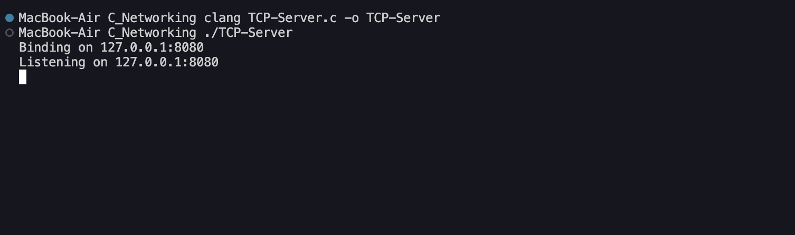
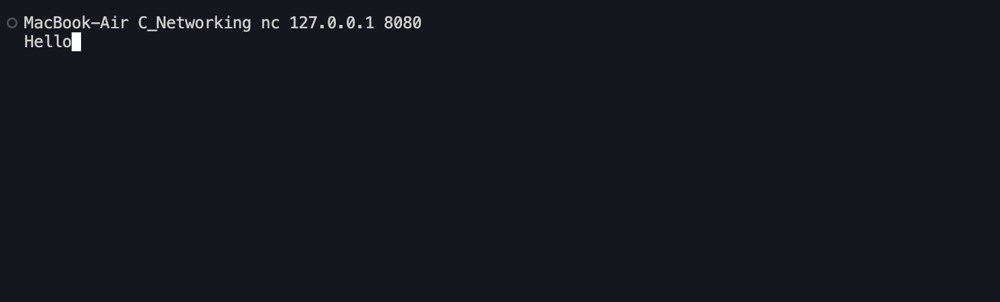
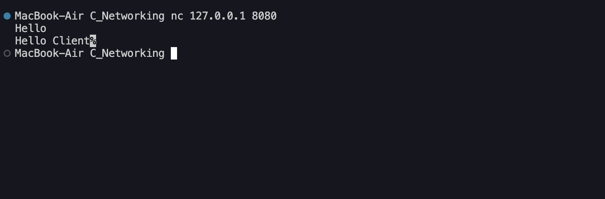
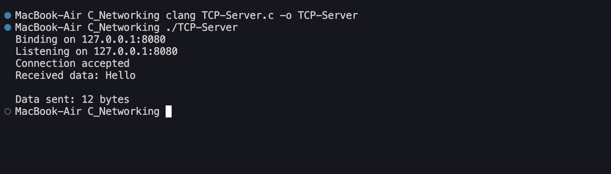

# TCP Server

A minimal **TCP server written from scratch in C** to understand how socket based networking works at a low level.

This project focuses on the fundamentals of TCP communication instead of implementing a full application layer protocol such as HTTP.

## Purpose

The goal of this project is to understand how a TCP server works internally and get comfortable with the core socket APIs provided by Unix like systems.

The server demonstrates the basic lifecycle of a TCP connection:

```text
socket()
   ↓
bind()
   ↓
listen()
   ↓
accept()
   ↓
recv()
   ↓
send()
   ↓
close()
```

## What I Learned

* What a socket is
* File descriptors and how sockets are represented
* Creating a TCP socket with `socket()`
* Configuring an IPv4 address with `sockaddr_in`
* Converting ports with `htons()`
* Converting IP addresses with `inet_pton()`
* Binding a socket to an IP address and port with `bind()`
* Putting a socket into listening mode with `listen()`
* Accepting incoming connections with `accept()`
* Understanding the difference between the listening socket and client socket
* Receiving data with `recv()`
* Sending data with `send()`
* Closing sockets with `close()`
* Understanding that TCP provides a **byte stream**, not application level messages

## How It Works

The server creates a TCP socket and binds it to:

```text
127.0.0.1:8080
```

It then listens for incoming TCP connections.

When a client connects, `accept()` returns a new file descriptor for that connection.

The important distinction is:

```text
socket_fd
    │
    └── Listening socket
         Waits for connections

client_fd
    │
    └── Connected socket
         Used for recv() and send()
```

The server receives data from the client and sends back:

```text
Hello Client
```

## Requirements

* macOS or another Unix like operating system
* C compiler such as Clang or GCC
* Netcat (`nc`) for testing

Check that a compiler is available:

```bash
clang --version
```

Check Netcat:

```bash
nc -h
```

## Build

Compile the server with:

```bash
clang TCP-Server.c -o ./TCP-Server
```

Then run it:

```bash
./TCP-Server
```

The server will listen on:

```text
127.0.0.1:8080
```



## Testing

Open another terminal and connect using Netcat:

```bash
nc 127.0.0.1 8080
```

Type some data:

```text
hello
```



The server receives the bytes sent by the client and responds with:

```text
Hello Client
```





This uses raw TCP data rather than HTTP, so tools such as `curl` are not needed for testing.

## Core Socket APIs

### `socket()`

Creates the socket:

```c
socket(AF_INET, SOCK_STREAM, 0);
```

* `AF_INET` → IPv4
* `SOCK_STREAM` → TCP
* `0` → use the default protocol for the socket type

### `bind()`

Associates the socket with an IP address and port:

```text
127.0.0.1:8080
```

### `listen()`

Marks the socket as a listening socket and allows incoming connection requests to queue.

### `accept()`

Waits for an incoming connection.

It returns a **new socket file descriptor** that is used to communicate with the connected client.

```text
socket_fd → listen

client_fd → communicate
```

### `recv()`

Reads bytes from the connected client socket.

```c
recv(client_fd, buffer, sizeof(buffer), 0);
```

The return value tells us how many bytes were received.

### `send()`

Sends bytes to the connected client:

```c
send(client_fd, data, length, 0);
```

### `close()`

Closes the socket file descriptor when it is no longer needed.

## Current Limitations

This is intentionally a small learning project.

It currently:

* Handles a single client connection
* Runs synchronously
* Uses IPv4
* Listens only on `127.0.0.1`
* Does not implement HTTP
* Does not support multiple clients at the same time
* Does not handle partial sends
* Does not have application protocol parsing

The goal here is to understand the basics before adding more complexity.

## Why C?

C makes the underlying networking model easier to see.

Instead of hiding sockets behind a high level networking library, this project works directly with Unix socket APIs and file descriptors.

The goal isn't to build a production server.

The goal is to understand what is actually happening underneath the abstractions.

---

**Status:** Learning Project
**Language:** C
**Protocol:** TCP
**Address:** `127.0.0.1:8080`
